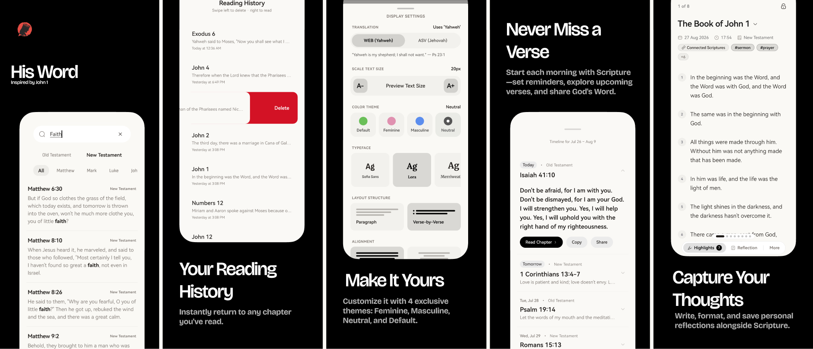

# His Word — Web Companion

The official web presence and companion platform for **His Word**, an offline-first mobile Bible study application built for focus, high-performance scripture study, and complete user privacy.

Live site: [word.sakhiledumisa.com](https://word.sakhiledumisa.com) • Story: [His Word, Quietly](https://www.sakhiledumisa.com/blog/his-word-quietly)

<p align="center">
  
</p>

## 🕊️ The Name & Origin

His Word is simple.

It comes from **John 1:1** — *"In the beginning was the Word, and the Word was with God, and the Word was God."*

The Word. Not noise. Not distraction. Not engagement metrics or pushy streaks. Just the Word. That is what this app is about.

### A Moment of Confusion

My grandmother has a smartphone. She’s had one for years.

She wanted to read the Bible on it, so I showed her a popular app — the one most people recommend. She opened it, and her face went from hopeful to confused in about four seconds:

> *"Yini lokhu konke?"* — *"What is all this?"*

Plans. Friends. Video clips. Image templates loading. Notifications waiting. Ads flashing. She couldn't find Genesis 1. She handed the phone back and picked up her paper Bible — the one with the tiny, faded print she can barely see anymore.

That app is good at what it does. It just wasn't built for her. It wasn't built for anyone who just wants to read Scripture in peace.

So I built one that is.

## 👥 Two Kinds of Bible Apps

There is nothing wrong with feature-rich Bible apps. They serve millions of people who want social accountability, video devotionals, and progress tracking.

But there is another kind of user:

| User Type | Reality |
| :--- | :--- |
| **The Focused Reader** | Wants to sit down and read the text. No popups, no tracking, no social pressure. |
| **The Thoughtful Student** | Needs dual translations side-by-side to understand hard words, highlights verses, and keeps a personal journal with rich reflection notes. |
| **The Hands-Free Listener** | Relies on clear, offline Text-to-Speech audio narration with configurable speeds and synchronized verse tracking when resting or on the move. |
| **The Offline Commuter** | Spotty signal, expensive data. Needs the entire Bible, search, audio, and history to work 100% offline. |
| **The Intentional Sharer** | Wants to share scripture with others, but wants it to look like a premium, beautifully typeset card, not a cluttered screenshot. |

These users don’t need streaks. They don’t need a social feed. They don't want to sign in.  
They just need the scriptures. **Clear. Fast. Beautiful.**

## 📱 What Is His Word?

**His Word** is a premium, offline-first Bible reading app designed to be a quiet sanctuary on your phone.

### ✨ Core App Features

* **Dual Offline Translations:** Read the World English Bible (WEB) and the American Standard Version (ASV) side-by-side or switch between them with zero loading delays.
* **Hands-Free Text-to-Speech Audio:** 100% offline audio scripture narration with customizable speeds (0.75x to 1.5x), custom voice selection, real-time verse highlight tracking, and automatic chapter progression.
* **Thoughtful Journaling & Reflections:** A fluid, horizontal paging journal deck for your reflection notes (with Markdown support and privacy locks) alongside customizable verse highlights.
* **Premium Typography & Curated Themes:** Five hand-picked typefaces (*Sofia Sans*, *Lora*, *Merriweather*, *Instrument Serif*, *PT Serif*) and four harmonized color themes (*Default Green*, *Feminine Rose*, *Masculine Blue*, and *Neutral Charcoal*) that adapt seamlessly to device light or dark modes.
* **Reading Customization:** Tailor your reading view with dynamic font sizing, paragraph vs. verse-by-verse layouts, customizable line height, and text alignment.
* **Daily Devotionals:** A rolling, locally scheduled *"Verse of the Day"* queue with special curated scripture selections for holidays like Christmas, Good Friday, and Easter.
* **Shake-to-Share Card Engine:** Shake your phone while reading to trigger subtle haptic feedback and instantly generate high-fidelity, beautifully typeset scripture cards to share with friends and family.
* **Deep Offline Search & Quick Actions:** Lightning-fast debounced search across all 66 books with instant keyword highlighting, plus native home screen App Shortcuts (long-press the app icon to jump straight into Search, Verse of the Day, History, or Bookmarks).
* **Zero Bloat Guarantee:** No accounts. No ads. No telemetry. No gamification. Just the scriptures.

### 🌐 Web Companion Features

* **Interactive Screenshots Carousel:** Touch-friendly slider utilizing Framer Motion for swipe gestures, dot indicators, and chevron navigation, coupled with a fullscreen Lightbox zoom and all-in-one mockup collage mode.
* **Global Custom Cursor & Micro-Interactions:** Smooth interactive cursor with dynamic spring physics and ambient background noise texture.
* **Multi-Language Support (Intlayer):** Content localized in English and isiZulu.
* **Back to Top & Sticky Navigation:** Floating quick-navigation actions with smooth scrolling.
* **Comprehensive Legal & Privacy Documentation:** Clear, plain-language privacy policies and terms of service.

## ⚖️ Design Choices: Compared

Here is how **His Word** compares to typical, feature-heavy Bible apps — not as criticism, but as contrast.

### Navigation & UX

| Most Apps | His Word |
| :--- | :--- |
| Multiple cluttered tabs (Home, Videos, Community, Profile) | **One clean screen:** your books list & instant search |
| Floating chapter dropdowns | **A large, easy-to-tap chapter selection grid** |
| Heavy swipe gestures | **Tap-focused navigation** (ideal for shaky fingers or older screens) |
| Multi-step menus to find key tools | **Quick Actions** from your phone's home screen & last-read auto-launch |
| 15–30 seconds to open | **Instant startup** directly to your reading session |

### Reading & Audio Experience

| Most Apps | His Word |
| :--- | :--- |
| Single translation by default (parallel modes hidden) | **Dual translations side-by-side**, always accessible |
| Generic default system fonts | **5 hand-selected, highly legible typefaces** (*Sofia Sans*, *Lora*, *Merriweather*, *Instrument Serif*, *PT Serif*) |
| Font controls buried in deep settings | **Instant reader customization toolbar** (font size, line spacing, layout, alignment) |
| Cloud-dependent or paywalled audio streaming | **100% offline Text-to-Speech audio reader** with real-time verse tracking & voice selector |
| One static dark mode | **4 curated color palettes** with system-adaptive light and dark modes |

### Data, Sharing & Privacy

| Most Apps | His Word |
| :--- | :--- |
| Account and sign-in required | **No accounts, no sign-ins** |
| Syncs and indexes your notes to the cloud | **Everything is stored strictly locally** on your device |
| Third-party analytics and data tracking | **Complete privacy;** zero telemetry, analytics, or trackers |
| Basic screenshot or cluttered text sharing | **Shake-to-capture high-resolution**, beautifully formatted scripture cards |
| Pushy engagement notifications to "keep your streak" | **Silent by default;** 100% opt-in local daily devotional reminders |

## 🛡️ What His Word Will Never Have

I wanted this app to feel respectful. To do that, I committed:

1. **No ads** – Not one. Not ever.
2. **No paid versions** – No premium tiers, in-app purchases, or subscription popups.
3. **No tracking** – Your reading habit is between you and God. I don't collect your data.
4. **No emails** – I don't want your address, and I will never send you marketing emails.
5. **No engagement spam** – The app will never beg for your attention with artificial streak notifications.
6. **No forced plans** – Read at your own pace. No guilt.

## 🛠️ Web Tech Stack

This companion website is built using modern web tooling:

* **Core:** React 19 & TypeScript
* **Meta-Framework:** [TanStack Start](https://tanstack.com/start) (SSR & fast client-side navigation)
* **Routing:** [TanStack Router](https://tanstack.com/router) (fully type-safe file-based router)
* **Server Engine:** [Nitro](https://nitro.unjs.io/) (high-performance deployment engine)
* **Styling:** [Tailwind CSS v4](https://tailwindcss.com/) & [HeroUI](https://heroui.com/)
* **Localization:** [Intlayer](https://intlayer.org/) (English & isiZulu)
* **State Management:** [Zustand](https://github.com/pmndrs/zustand)
* **Animations:** [Motion (Framer Motion)](https://motion.dev/)
* **Linting & Formatting:** [Biome](https://biomejs.dev/)

## 🚀 Getting Started

### Prerequisites

Ensure you have [Node.js](https://nodejs.org/) installed along with [pnpm](https://pnpm.io/).

### Installation

```bash
pnpm install
```

### Run the Development Server

```bash
pnpm dev
```

The application will be served at `http://localhost:3000`.

### Production Build

```bash
pnpm build
```

This compiles both the client-side code and the Nitro server bundle into the `.output/` and `.tanstack/` folders.

## 🌐 Routing & SEO

* `/` — `src/routes/index.tsx` (Homepage, Showcase & FAQ)
* `/privacy-policy` — `src/routes/privacy-policy.tsx` (Privacy guidelines)
* `/terms-of-use` — `src/routes/terms-of-use.tsx` (Terms of service)

### Sitemap & Search Optimization
* **Sitemap:** [public/sitemap.xml](public/sitemap.xml)
* **Robots.txt:** [public/robots.txt](public/robots.txt)
* **SEO Metadata:** Canonical URLs, OpenGraph, Twitter Cards, and structured JSON-LD schemas.

## 📝 Learn More & Story

Read the complete design philosophy and personal back-story:
* 📖 Blog Post: [His Word, Quietly](https://www.sakhiledumisa.com/blog/his-word-quietly)
* 🌐 Live Site: [word.sakhiledumisa.com](https://word.sakhiledumisa.com)

Developed with focus by [Sakhile Dumisa](https://www.github.com/sakhile-dumisa).
